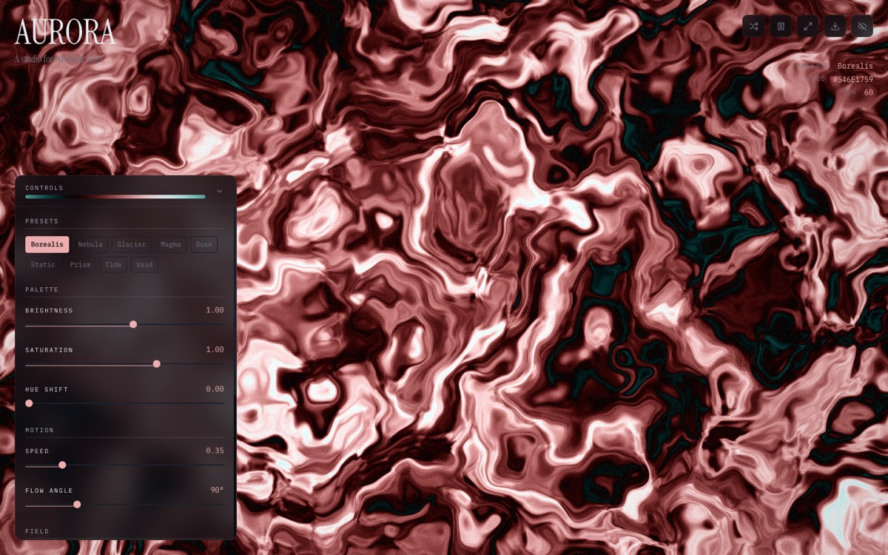

# Aurora

> Generative 'synthetic skies' — a real-time WebGL shader, not CSS gradients. React + GLSL + Zustand.

**[Live demo](https://aurora-liart-three.vercel.app)** · part of [my portfolio](https://portfolio-delta-snowy-rw5w2y5pf8.vercel.app)



## What it is

A generative sky machine: an animated, fully parameterized aurora rendered by a fragment shader in real time. The differentiator is that it's a *real* shader — layered simplex noise computed per-pixel on the GPU — where most "aurora" sites fake it with blurred CSS gradients.

## How it works

- The sky is one fragment shader (`src/gl/shaders.js`): Ashima 2D simplex noise stacked into fBM with a runtime-tunable octave count (`u_octaves`), driving color through a procedural palette.
- The control panel is wired straight to shader uniforms — a Zustand store (`useAuroraStore`) holds the parameters and `useAuroraGL` pushes them to the GPU every frame, so every slider edit is live at render speed.
- Export goes both ways: a PNG snapshot of the actual canvas (`canvas.toBlob`), and a `generateCss()` function that approximates the current sky as stacked CSS `radial-gradient`s you can paste into any stylesheet.
- No Three.js — raw WebGL with a small GL utility layer, because a fullscreen quad and one shader don't need a scene graph.

## Stack

`React` · `WebGL/GLSL` · `Zustand` · `Vite`

## Run locally

```bash
npm install
npm run dev
```

No environment variables needed.
